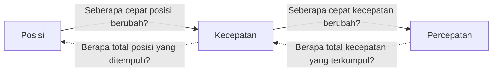

# Kinematika: Analisis Gerak Benda

[< Kembali ke Daftar Materi Kelas 10](./README.md) | [Ke Beranda](../README.md)

---

**Kinematika** adalah cabang ilmu Fisika yang mempelajari gerak suatu benda tanpa meninjau penyebab atau gaya yang mendasarinya. Di sini kita fokus pada deskripsi gerak: seberapa jauh, seberapa cepat, dan seberapa lama sebuah benda berpindah.

---

## 1. Konsep Dasar Gerak

Sebelum kita masuk ke jenis-jenis gerak, sangat penting untuk memahami perbedaan antara besaran skalar dan besaran vektor dalam kinematika.

### 1.1 Posisi, Jarak, dan Perpindahan
- **Posisi:** Letak suatu benda pada suatu waktu tertentu terhadap titik acuan.
- **Jarak (Skalar):** Total panjang lintasan yang ditempuh benda. Nilainya selalu positif.
- **Perpindahan (Vektor):** Perubahan posisi benda (selisih posisi akhir dan awal). Disimbolkan sebagai $\Delta \vec{x} = \vec{x}_t - \vec{x}_0$.

### 1.2 Kelajuan dan Kecepatan
- **Kelajuan (Skalar):** Jarak per satuan waktu.
  

$$
\Large v = \frac{s}{t}
$$
- **Kecepatan (Vektor):** Perpindahan per satuan waktu.
  

$$
\Large \vec{v} = \frac{\Delta \vec{x}}{\Delta t} = \frac{\vec{x}_t - \vec{x}_0}{t_t - t_0}
$$

> [!TIP]
> **Kecepatan Rata-rata Lintasan Bertahap:**
> Jika benda menempuh paruh jarak pertama dengan $v_1$ dan paruh jarak kedua dengan $v_2$, kecepatan rata-ratanya adalah **rata-rata harmonik**:
> 

$$
\Large v_{avg} = \frac{2 \cdot v_1 \cdot v_2}{v_1 + v_2}
$$

**Kecepatan Relatif 2 Dimensi (Kasus Vektor):**
Jika sebuah benda (misal perahu) bergerak dengan kecepatan $\vec{v}_p$ di atas medium (misal sungai) yang juga bergerak dengan kecepatan $\vec{v}_s$, maka kecepatan total perahu terhadap pengamat diam di pinggir adalah:

$$
\Large \vec{v}_{\text{total}} = \vec{v}_p + \vec{v}_s
$$
Jika perahu menyeberang tegak lurus arus, besar kecepatan resultannya adalah:

$$
\Large v_{\text{res}} = \sqrt{v_p^2 + v_s^2}
$$

> [!IMPORTANT]
> **Notasi Vektor Formal Kecepatan Relatif:**
> Secara umum, kecepatan benda A terhadap benda B ($\vec{v}_{AB}$) didefinisikan sebagai selisih vektor keduanya:
> 

$$
\Large \vec{v}_{AB} = \vec{v}_A - \vec{v}_B = (v_{Ax} - v_{Bx})\hat{i} + (v_{Ay} - v_{By})\hat{j}
$$
> Konsep ini sangat vital untuk menganalisis pergerakan pesawat di tengah angin kencang dari sudut sembarang.

> [!TIP]
> **Aplikasi Navigasi: Heading vs Track**
> - **Heading:** Arah ke mana hidung pesawat/kapal diarahkan.
> - **Track (Course):** Arah gerak nyata pesawat terhadap bumi (hasil resultan dengan angin/arus).
> Agar pesawat bisa terbang lurus ke Timur sementara angin bertiup dari Utara, pilot harus mengarahkan hidung pesawat sedikit ke arah North-East (*Heading*) agar hasil resultannya tetap tepat ke East (*Track*).

### 1.3 Percepatan (Acceleration)
Perubahan kecepatan tiap satuan waktu. Percepatan bernilai positif ($+$) berarti benda dipercepat, sedangkan negatif ($-$) berarti benda diperlambat.

$$
\Large a = \frac{\Delta v}{\Delta t} = \frac{v_t - v_0}{t}
$$

> [!WARNING]
> **Miskonsepsi Titik Balik (v = 0 ≠ a = 0):**
> Saat Anda melempar bola ke atas, di titik tertinggi kecepatannya adalah **nol ($v=0$)**. Namun, percepatannya **TIDAK nol**, melainkan tetap $g = -10 \text{ m/s}^2$ (gravitasi). Jika percepatannya nol saat $v=0$, maka bola akan melayang selamanya di puncak. 
> *Ingat: Berhenti sejenak untuk berbalik arah tetap memerlukan percepatan!*

### 1.4 Kinematika dengan Analisis Vektor (Kalkulus Dasar)
Pada tingkat lanjut, besaran kinematika didefinisikan menggunakan operasi turunan (derivatif):
- **Kecepatan Sesaat ($v$):** Turunan pertama fungsi posisi ($r$) terhadap waktu.
  

$$
\Large v(t) = \frac{dr}{dt}
$$
- **Percepatan Sesaat ($a$):** Turunan pertama fungsi kecepatan ($v$) terhadap waktu.
  

$$
\Large a(t) = \frac{dv}{dt}
$$
*(Contoh: Jika $r(t) = 2t^3$, maka $v(t) = 6t^2$ dan $a(t) = 12t$).*

### 1.5 Filosofi "Keluarga" Kinematika
Ketiga besaran utama kinematika saling terhubung dalam satu aliran logika waktu:

- **Turun ($\downarrow$):** Menggunakan operasi **Turunan (Derivatif)**.
- **Naik ($\uparrow$):** Menggunakan operasi **Integral**.

---

## 2. Gerak Lurus Beraturan (GLB)

GLB adalah gerak benda pada lintasan lurus dengan **kecepatan konstan ($v$ tetap)**. Artinya, percepatannya adalah nol ($a = 0$).

- **Ciri Utama:** Dalam selang waktu yang sama, benda menempuh jarak yang sama.
- **Rumus:**
  

$$
\Large s = v \cdot t
$$
- **Grafik GLB:**
  - Grafik $s-t$ (Jarak-Waktu) berupa garis lurus miring ke atas (linear).
  - Grafik $v-t$ (Kecepatan-Waktu) berupa garis lurus mendatar (horizontal).

- **Jika Keduanya GLB (Berlawanan Arah/Berpapasan):**
  Dua benda terpisah jarak $D$. Waktu bertemu ($t$):
  

$$
\Large t = \frac{D}{v_A + v_B}
$$
- **Jika Keduanya GLB (Searah/Menyusul):**
  Benda B mengejar A. Waktu menyusul ($t$):
  

$$
\Large t = \frac{\Delta x_{awal}}{v_B - v_A}
$$
- **Jika Salah Satu atau Keduanya GLBB:**
  Gunakan persamaan posisi GLBB ($s = v_0 t + \frac{1}{2}at^2$) dan selesaikan persamaan kuadrat untuk mencari $t$. (Pastikan arah $a$ positif/negatif sesuai acuan).

---

## 3. Gerak Lurus Berubah Beraturan (GLBB)
GLBB adalah gerak benda pada lintasan lurus dengan **percepatan konstan ($a$ tetap)**. Artinya, kecepatannya berubah secara teratur.

> [!NOTE]
> **Asal-usul (Derivasi) Rumus GLBB:**
> 1. **Rumus 1:** Berasal dari definisi $a = (v_t - v_0)/t \implies \mathbf{v_t = v_0 + at}$.
> 2. **Rumus 2:** Berasal dari luas daerah di bawah grafik $v-t$ (Trapesium).
>    $s = \text{Luas} = \frac{(v_0 + v_t)}{2} \cdot t$. Substitusi $v_t$ dari rumus 1:
>    $s = \frac{(v_0 + v_0 + at)}{2} \cdot t = \mathbf{v_0 t + \frac{1}{2}at^2}$.
> 3. **Rumus 3:** Kuadratkan rumus 1: $v_t^2 = (v_0 + at)^2 = v_0^2 + 2v_0at + a^2t^2$.
>    Faktorkan $2a$: $v_t^2 = v_0^2 + 2a(v_0t + \frac{1}{2}at^2)$. Substitusi Rumus 2:
>    $\mathbf{v_t^2 = v_0^2 + 2as}$.

- **Rumus Utama GLBB:**
  1. $v_t = v_0 + a \cdot t$ (Mencari kecepatan akhir)
  3. $v_t^2 = v_0^2 + 2 \cdot a \cdot s$ (Mencari hubungan kecepatan dan jarak tanpa waktu)

> [!TIP]
> **Aplikasi: Analisis Jarak Henti (Stopping Distance)**
> Seberapa jauh mobil meluncur setelah rem diinjak sampai berhenti ($v_t = 0$)?
> Dari rumus 3: $0 = v_0^2 - 2as \implies \mathbf{s_{\text{henti}} = \frac{v_0^2}{2a}}$.
> *Kesimpulan: Jika kecepatan mobil naik 2 kali lipat, jarak hentinya akan naik 4 kali lipat! Inilah mengapa mengebut sangat berbahaya.*

- **Grafik GLBB:**
  - Grafik $a-t$ (Percepatan-Waktu) berupa garis lurus mendatar (asumsikan $a \neq 0$).
  - Grafik $v-t$ (Kecepatan-Waktu) berupa garis lurus miring ($a > 0$ miring ke atas, $a < 0$ miring ke bawah).
  - Grafik $s-t$ (Jarak-Waktu) berupa lintasan melengkung (parabola).

> [!IMPORTANT]
> **Metode Luas Area:** Jarak tempuh benda dapat dihitung dengan mencari **Luas di bawah kurva** pada grafik kecepatan terhadap waktu ($v-t$).

---

## 4. Analisis Grafik Gerak
Memahami gerak melalui interpretasi visual:
- **Grafik $s-t$:** Kemiringan (gradien) garis menunjukkan **kecepatan**. Jika garis melengkung (parabola), benda memiliki **percepatan**.
- **Grafik $v-t$:**
  - Kemiringan garis menunjukkan **percepatan**.
  - Luas daerah di bawah kurva menunjukkan **perpindahan/jarak**.

### 4.1 Mastery Framework: Strategi Gerak Bertahap
Dalam soal nyata, sering ditemukan benda yang bergerak dalam beberapa fase (misal: dipercepat, lalu kecepatan tetap, lalu diperlambat).
- **Kunci Utama:** Pecah soal menjadi beberapa interval waktu ($t_1, t_2, ...$).
- **Prinsip Kontinuitas:** Kecepatan akhir pada fase 1 ($v_{t1}$) otomatis menjadi kecepatan awal pada fase 2 ($v_{02}$).
- **Skema Penyelesaian:** 
  Total Jarak $= s_1 + s_2 + s_3 + ...$
  Total Waktu $= t_1 + t_2 + t_3 + ...$

---
- **Grafik $a-t$:**
  - Luas daerah di bawah kurva menunjukkan **perubahan kecepatan**.

> [!NOTE]
> **Metode Luas Arbitrer (Intuisi Integral):**
> Meskipun grafik $v-t$ tidak berbentuk trapesium sempurna (misal melengkung tak beraturan), prinsip **Luas di bawah kurva = Perpindahan** tetap berlaku secara universal. Di tingkat lanjut, luas ini dihitung dengan membagi area menjadi ribuan batang sangat tipis (Integral), membuktikan bahwa Kinematika adalah bahasa matematika yang sangat logis.

> [!TIP]
> **Kaitan Sempurna dengan Kalkulus:**
> 1. **Kecepatan Sesaat:** Secara grafis adalah **kemiringan (gradien) garis singgung** kurva posisi-waktu ($s-t$).
> 2. **Percepatan Sesaat:** Adalah kemiringan garis singgung kurva kecepatan-waktu ($v-t$).
> Jika grafik $s-t$ melengkung semakin tajam ke atas, gradiennya bertambah, yang berarti benda sedang dipercepat.

---

## 5. Gerak Vertikal (Gerak Satu Dimensi dengan Gravitasi)

Gerak vertikal adalah aplikasi nyata GLBB di mana percepatan yang dialami benda adalah percepatan gravitasi bumi ($g \approx 9,8 \text{ m/s}^2$ atau sering dibulatkan menjadi $10 \text{ m/s}^2$).

> [!TIP]
> **Aturan Tanda (+) dan (-) Gravitasi:**
> Untuk konsistensi, gunakan acuan **Vektor**:
> - Arah **Ke Atas** = Positif ($+$).
> - Arah **Ke Bawah** = Negatif ($-$).
> - Karena gravitasi selalu menarik **ke bawah**, maka dalam perhitungan (GVA/GJB) nilai $g$ selalu **$-10 \text{ m/s}^2$** jika posisi awal dianggap nol.
> - *Catatan: Banyak buku menyederhanakan GJB dengan $+g$ karena benda searah gravitasi, namun aturan vektor di atas lebih aman untuk soal kompleks.*

### 5.1 Gerak Jatuh Bebas (GJB)
Benda dijatuhkan tanpa kecepatan awal ($v_0 = 0$).
- $v_t = g \cdot t$
- $h = \frac{1}{2} \cdot g \cdot t^2$
- $v_t = \sqrt{2 \cdot g \cdot h}$

> [!IMPORTANT]
> **Paradoks Galileo: Bulu vs Bola Besi**
> Aristotle berpendapat benda berat jatuh lebih cepat. Galileo membantahnya: Dalam kondisi **Vakum** (tanpa udara), bulu dan bola besi jatuh dengan percepatan yang **sama persis**.
> - **Di Udara:** Bulu tertahan oleh gaya hambat udara yang besar dibanding beratnya.
> - **Hukum Alam:** Gravitasi memberikan percepatan $g$ yang sama pada *semua* materi, tanpa mempedulikan massanya.

### 5.2 Gerak Vertikal ke Atas (GVA)
Benda dilempar ke atas dengan $v_0$ tertentu. Benda akan melambat karena gravitasi bersifat menghambat ($-g$).
- **Di titik tertinggi:** Kecepatan sesaat benda adalah nol ($v_t = 0$).
- $h_{\text{max}} = \frac{v_0^2}{2g}$
- $t_{\text{naik}} = \frac{v_0}{g}$

### 5.3 Gerak Vertikal ke Bawah (GVB)
Benda dilempar ke bawah dengan kecepatan awal ($v_0 \neq 0$). Gunakan rumus GLBB dengan mengganti $a = +g$.

### 5.4 Pertemuan Dua Benda di Udara
Jika benda A dilempar ke atas dari tanah dan benda B dijatuhkan dari ketinggian $H$ di atasnya, mereka akan bertemu jika:

$$
\Large y_A + y_B = H
$$
(dengan $y_A$ adalah posisi bola A dan $y_B$ adalah jarak jatuh bola B).

---

## 6. Gerak Parabola (Projectile Motion)

Gerak parabola adalah perpaduan dua gerak pada dua sumbu koordinat yang saling tegak lurus:
1. **Sumbu X (Horizontal):** Bergerak secara **GLB** (kecepatan tetap $v_x = v_0 \cos \alpha$).
2. **Sumbu Y (Vertikal):** Bergerak secara **GLBB** (dipengaruhi gravitasi $v_y = v_0 \sin \alpha - gt$).

- **Kecepatan Awal di Sumbu X:** $v_{0x} = v_0 \cos \alpha$
- **Kecepatan Awal di Sumbu Y:** $v_{0y} = v_0 \sin \alpha$
- **Tinggi Maksimum ($h_{\text{max}}$):**
  

$$
\Large h_{\text{max}} = \frac{v_0^2 \sin^2 \alpha}{2g}
$$
- **Jarak Terjauh ($x_{\text{max}}$):**
  

$$
\Large x_{\text{max}} = \frac{v_0^2 \sin 2\alpha}{g}
$$

**Persamaan Posisi Setiap Saat ($t$):**
Koordinat peluru pada sembarang waktu $t$ selama di udara:
- **Posisi Mendatar ($x$):** $x(t) = v_0 \cos \alpha \cdot t$
- **Posisi Vertikal ($y$):** $y(t) = v_0 \sin \alpha \cdot t - \frac{1}{2}gt^2$

  

$$
\Large v_t = \sqrt{v_x^2 + v_{ty}^2} \quad \text{di mana } v_{ty} = v_0 \sin \alpha - gt
$$

**Vektor Kecepatan dalam Notasi $\hat{i}, \hat{j}$:**

$$
\Large \vec{v}(t) = (v_0 \cos \alpha) \hat{i} + (v_0 \sin \alpha - gt) \hat{j}
$$

**Vektor Posisi dalam Notasi $\hat{i}, \hat{j}$:**
Untuk mengetahui koordinat persis benda di ruang 2D pada waktu $t$:

$$
\Large \vec{r}(t) = (v_0 \cos \alpha \cdot t) \hat{i} + (v_0 \sin \alpha \cdot t - \frac{1}{2}gt^2) \hat{j}
$$

**Analisis Sudut Elevasi Maksimum:**
Jangkauan terjauh ($x_{\text{max}}$) akan dicapai jika $\sin 2\alpha$ bernilai maksimum (yaitu 1). Hal ini terjadi saat $2\alpha = 90^\circ$, atau **$\alpha = 45^\circ$**.

> [!NOTE]
> **Pembuktian Matematis:**
> Rumus jangkauan: $x_{max} = \frac{v_0^2 \sin 2\alpha}{g}$.
> Karena $v_0$ dan $g$ bernilai tetap dalam satu tembakan, maka $x_{max}$ hanya bergantung pada nilai $\sin 2\alpha$.
> Nilai sinus tertinggi di matematika adalah **1**, yang dicapai oleh sudut **90°**.
> Maka, $2\alpha = 90^\circ \implies \alpha = 45^\circ$.

**Persamaan Lintasan ($y$ sebagai fungsi $x$):**
Jika kita mengeliminasi variabel waktu ($t$), kita mendapatkan persamaan parabola murni:

$$
\Large y = x \tan \alpha - \frac{gx^2}{2v_0^2 \cos^2 \alpha}
$$

**Penembakan dari Ketinggian ($H$):**
Jika benda ditembakkan dari puncak gedung setinggi $H$, maka posisi vertikalnya terhadap tanah adalah:

$$
\Large y(t) = H + v_0 \sin \alpha \cdot t - \frac{1}{2}gt^2
$$
*(Benda mencapai tanah saat $y = 0$).*

**Sifat Sudut Komplementer:**
Jangkauan mendatar ($x_{\text{max}}$) akan bernilai sama untuk dua sudut elevasi $\theta_1$ dan $\theta_2$ yang berjumlah $90^\circ$ (misal $30^\circ$ dan $60^\circ$).

> [!IMPORTANT]
> **Gerak Parabola pada Bidang Miring:**
> Jika sasaran berada pada tanah yang miring dengan sudut $\beta$:
> 1. **Metode Putar Sumbu:** Anggap sumbu X sejajar bidang miring.
> 2. Akibatnya, gravitasi memiliki komponen di sumbu X ($g \sin \beta$) dan sumbu Y ($g \cos \beta$).
> 3. Gerak di sumbu X bukan lagi GLB, melainkan **GLBB diperlambat**.
> 

$$
\Large x(t) = (v_0 \cos \theta)t - \frac{1}{2}(g \sin \beta)t^2
$$
> 

$$
\Large y(t) = (v_0 \sin \theta)t - \frac{1}{2}(g \cos \beta)t^2
$$

> [!WARNING]
> **Jebakan Soal (Titik Tertinggi):**
> Pada titik tertinggi gerak parabola, kecepatan benda **TIDAK NOL**. Hanya kecepatan vertikal ($v_y$) yang nol, sedangkan kecepatan horizontal ($v_x$) tetap ada. 
> Kecepatan total di puncak adalah: $\mathbf{v_{\text{puncak}} = v_0 \cos \alpha}$.

> [!TIP]
> **Logika Fisika Parabola:**
> - Kenapa $v_y = 0$ di puncak? Karena gravitasi terus menarik benda ke bawah hingga kecepatan naiknya habis tepat di titik tertinggi.
> - Kenapa waktu naik = waktu turun? Karena percepatan gravitasi yang memperlambat saat naik besarnya sama dengan yang mempercepat saat turun (Azas Simetri).

---

## 7. Gerak Melingkar Beraturan (GMB)
GMB adalah gerak benda dalam lintasan lingkaran dengan laju tetap, namun arah kecepatannya selalu berubah (kecepatan linearnya tidak konstan).

> [!NOTE]
> **Makna Filosofis "Beraturan":**
> Dalam Fisika, kata "Beraturan" pada GMB merujuk pada **Besar Kecepatan (Laju)** yang konstan. Namun secara **Vektor**, gerak ini sebenarnya tidak beraturan karena arahnya terus "dipaksa" berubah oleh pusat lingkaran. Itulah sebabnya GMB memiliki percepatan ($a_s$) meski angkanya terlihat stabil.

### 7.1 Besaran-Besaran GMB
- **Frekuensi ($f$):** Jumlah putaran tiap detik. ($f = n / t$, satuan Hertz).
- **Periode ($T$):** Waktu untuk satu kali putaran penuh. ($T = t / n$, satuan sekon). ($T = 1/f$).
- **Kecepatan Sudut ($\omega$):** Sudut yang ditempuh per satuan waktu.
  

$$
\Large \omega = \frac{2\pi}{T} = 2\pi f
$$
- **Kecepatan Linear ($v$):** Laju pada pinggir lingkaran.
  

$$
\Large v = \omega \cdot R
$$

> [!TIP]
> **Pintasan Konversi RPM:**
> Satuan **RPM** (Rotations Per Minute) adalah satuan frekuensi yang sering muncul di alat teknik (mesin).
> 

$$
\Large 1 \text{ RPM} = \frac{2\pi}{60} \text{ rad/s} = \frac{\pi}{30} \mathbf{\text{ rad/s}}
$$
> *(Contoh: $300 \text{ RPM} = 300 \cdot \frac{\pi}{30} = 10\pi \text{ rad/s}$).*

> [!NOTE]
> **Asal-usul $v = \omega R$:**
> Dari definisi panjang busur lingkaran: $s = \theta \cdot R$.
> Jika kita bagi kedua ruas dengan waktu ($t$):
> $\frac{s}{t} = \frac{\theta}{t} \cdot R \implies \mathbf{v = \omega R}$.

$$
\Large a_s = \frac{v^2}{R} = \omega^2 \cdot R
$$

> [!NOTE]
> **Derivasi Geometris $a_s$:**
> Saat benda bergerak dari posisi 1 ke posisi 2 dalam waktu singkat $\Delta t$, vektor kecepatannya berubah arah sebesar $\Delta \theta$.
> Jika kita gambar selisih vektor kecepatannya ($\Delta \vec{v}$), akan terbentuk segitiga yang sebangun dengan segitiga posisi-jari-jari.
> Perbandingan sisi: $\frac{\Delta v}{v} = \frac{\Delta s}{R}$.
> Karena $\Delta s = v \cdot \Delta t$, maka $\frac{\Delta v}{v} = \frac{v \cdot \Delta t}{R} \implies \frac{\Delta v}{\Delta t} = \frac{v^2}{R} \mathbf{= a_s}$.
> *Arah $\Delta v$ (dan $a_s$) selalu menuju pusat lingkaran.*

> [!NOTE]
> **Kenapa $a_s$ tegak lurus $v$?**
> Jika percepatan memiliki komponen searah $v$, maka **laju** benda akan berubah (bertambah/berkurang). Karena pada GMB laju benda konstan, maka seluruh percepatan harus tegak lurus searah jari-jari hanya untuk mengubah **arah** gerak benda.

> [!IMPORTANT]
> **Miskonsepsi Umum:**
> "Benda di GMB tidak punya percepatan karena kecepatannya tetap."
> **Faktanya:** Laju memang tetap, tapi **Vektor Kecepatan** berubah arah setiap saat. Perubahan arah ini adalah bukti adanya percepatan sentripetal.

### 7.3 Hubungan Roda-Roda
1. **Dua Roda Seporos (Satu As):**
   Arah putar sama dan **Kecepatan Sudut sama ($\omega_A = \omega_B$)**.
2. **Dua Roda Bersinggungan / Dihubungkan Sabuk:**
   Arah putar bisa sama (sabuk lurus) atau beda (bersinggungan), namun **Kecepatan Linear sama ($v_A = v_B$)**.

### 7.4 Gerak Melingkar Berubah Beraturan (GMBB)
GMBB adalah gerak melingkar dengan **Percepatan Sudut ($\alpha$)** konstan.
- **Kecepatan Sudut Akhir:** $\omega_t = \omega_0 + \alpha \cdot t$
- **Posisi Sudut (Sudut Tempuh):** $\theta = \omega_0 \cdot t + \frac{1}{2} \alpha \cdot t^2$
- **Percepatan Tangensial ($a_t$):** Percepatan yang sejajar lintasan (mengubah laju linear).
  

$$
\Large a_t = \alpha \cdot R
$$

### 7.5 Percepatan Total ($a_{\text{tot}}$)
Pada GMBB, benda memiliki dua percepatan yang saling tegak lurus ($a_s$ dan $a_t$):

$$
\Large a_{\text{tot}} = \sqrt{a_s^2 + a_t^2}
$$

> [!IMPORTANT]
> **Generalisasi Percepatan pada Kurva Sembarang:**
> Konsep $a_s$ dan $a_t$ tidak hanya berlaku untuk lingkaran, tapi untuk **semua lintasan melengkung** (seperti mobil di tikungan jalan raya):
> - **$a_s$ (Sentripetal):** Komponen percepatan yang tegak lurus kecepatan, berfungsi mengubah **Arah**.
> - **$a_t$ (Tangensial):** Komponen percepatan yang searah kecepatan, berfungsi mengubah **Laju**.
> Jika Anda menyetir mobil sambil menambah gas di tikungan, Anda sedang mengalami kedua percepatan ini secara bersamaan.

### 7.6 Analogi Gerak: Lurus vs Melingkar
GMBB memiliki pola rumus yang identik dengan GLBB. Anda cukup mengganti variabelnya saja:

| Besaran | Gerak Lurus (GLBB) | Gerak Melingkar (GMBB) | Hubungan Kedua Gerak |
| :--- | :--- | :--- | :--- |
| **Posisi** | Jarak/Perpindahan ($s$) | Posisi Sudut ($\theta$) | $s = \theta \cdot R$ |
| **Kecepatan** | Kecepatan ($v$) | Kecepatan Sudut ($\omega$) | $v = \omega \cdot R$ |
| **Percepatan** | Percepatan ($a$) | Percepatan Sudut ($\alpha$) | $a_t = \alpha \cdot R$ |
| **Rumus 1** | $v_t = v_0 + a t$ | $\omega_t = \omega_0 + \alpha t$ | — |
| **Rumus 2** | $s = v_0 t + \frac{1}{2} a t^2$ | $\theta = \omega_0 t + \frac{1}{2} \alpha t^2$ | — |
| **Rumus 3** | $v_t^2 = v_0^2 + 2 a s$ | $\omega_t^2 = \omega_0^2 + 2 \alpha \theta$ | — |

### 7.7 Aplikasi Nyata: Menikung Tajam
Pernahkah Anda melihat pelari atletik atau pembalap motor mencondongkan badan ke arah dalam saat menikung? 
Secara kinematika, mereka sedang berusaha menciptakan kemiringan agar ada komponen percepatan yang mampu mengubah arah kecepatan motor/tubuh mereka secara efektif menuju pusat tikungan ($a_s$). Tanpa kemiringan atau gesekan yang cukup, benda akan cenderung bergerak lurus (Inersia) dan keluar dari lintasan.

---

*(Untuk pembahasan lebih mendalam dan latihan soal, silakan kunjungi [Halaman Latihan Soal Kinematika](./latihan-soal/README.md))*
